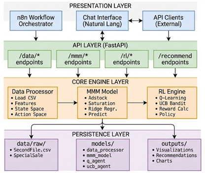
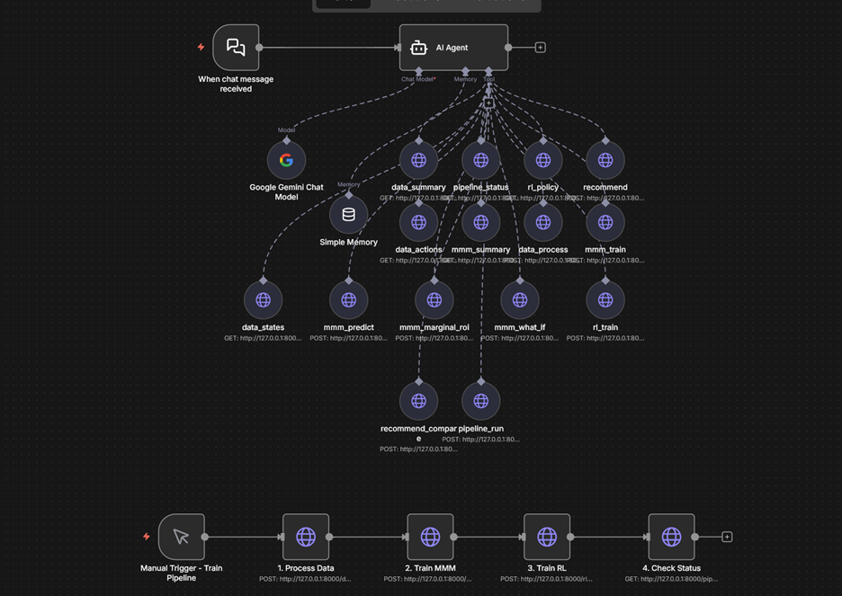

# Marketing Mix Optimization with Reinforcement Learning

An end-to-end system that combines Marketing Mix Modeling (MMM) with Reinforcement Learning (Q-Learning and UCB Bandit) to optimize marketing budget allocation across channels.

## Table of Contents

1. [Project Overview](#project-overview)
2. [System Architecture](#system-architecture)
3. [System Requirements](#system-requirements)
4. [Installation Instructions](#installation-instructions)
5. [Setup and Configuration](#setup-and-configuration)
6. [Running the Application](#running-the-application)
7. [Documentation of Reinforcement Learning Approach](#documentation-of-reinforcement-learning-approach)
8. [Test Environment and Simulation Framework](#test-environment-and-simulation-framework)
9. [Project Structure](#project-structure)
10. [API Reference](#api-reference)
11. [Troubleshooting](#troubleshooting)

---

## Project Overview

This system addresses the challenge of optimal marketing budget allocation across multiple channels. It ingests historical marketing data, trains a Marketing Mix Model to understand channel effectiveness, and uses Reinforcement Learning agents to learn optimal allocation strategies.

### Key Features

- Marketing Mix Model with adstock and saturation transformations
- Q-Learning agent for value-based optimization
- UCB Bandit agent for exploration-exploitation balance
- FastAPI REST endpoints for programmatic access
- n8n workflow integration for natural language interaction

### What This System Does

1. Ingests monthly marketing data (channel spend, revenue, NPS)
2. Trains MMM to estimate how each channel affects revenue
3. Discovers actions from historical allocation patterns using K-means clustering
4. Trains RL policies (Q-Learning and UCB) to optimize allocations
5. Recommends optimal budget allocations based on context
6. Exposes API for agentic orchestration via n8n

---

## System Architecture



The system follows a four-layer modular architecture:

- **Presentation Layer:** n8n workflow orchestrator and natural language chat interface
- **API Layer:** FastAPI REST endpoints for data, MMM, RL, and recommendations
- **Core Engine Layer:** Data Processor, MMM Model, and RL Engine (Q-Learning + UCB)
- **Persistence Layer:** Raw CSV files, serialized models, and visualization outputs

### n8n Workflow



The agentic workflow enables natural language interaction with the optimization system through 16 connected API tools.

---

## System Requirements

### Software Requirements

| Software | Version | Required |
|----------|---------|----------|
| Python | 3.10 or higher | Yes |
| pip | Latest | Yes |
| n8n | Latest | Optional (for workflow) |

### Hardware Requirements

| Resource | Minimum | Recommended |
|----------|---------|-------------|
| RAM | 4 GB | 8 GB |
| Storage | 500 MB | 1 GB |
| CPU | 2 cores | 4 cores |

---

## Installation Instructions

### Step 1: Clone the Repository

```bash
git clone https://github.com/yourusername/marketing-mix-rl.git
cd marketing-mix-rl
```

### Step 2: Create Virtual Environment

```bash
python -m venv venv
```

Activate the virtual environment:

On Windows:
```bash
venv\Scripts\activate
```

On macOS/Linux:
```bash
source venv/bin/activate
```

### Step 3: Install Dependencies

```bash
pip install -r requirements.txt
```

### Step 4: Verify Installation

```bash
python -c "import pandas; import numpy; import sklearn; import fastapi; print('All dependencies installed successfully')"
```

---

## Setup and Configuration

### Data Setup

Place your data files in the `data/raw/` directory:

- `SecondFile.csv` - Main marketing data with columns: Date, channel spends (TV, Digital, Sponsorship, Content.Marketing, Online.marketing, Affiliates, SEM, Radio, Other), total_gmv, NPS
- `SpecialSale.csv` - Promotional calendar with columns: Date, Sales Name

### Configuration File

The system is configured via `config.yaml`. Key settings:

```yaml
# Channels to analyze
channels:
  - TV
  - Digital
  - Sponsorship
  - Content.Marketing
  - Online.marketing
  - Affiliates
  - SEM
  - Radio
  - Other

# Target variable
target: "total_gmv"

# State space dimensions
state:
  month_index:
    enabled: true
    bins: 12
  budget_level:
    enabled: true
    bins: 5
  nps_level:
    enabled: true
    bins: 3
  revenue_trend:
    enabled: true
    bins: 3
  has_promotion:
    enabled: true
    bins: 2

# RL settings
rl:
  q_learning:
    alpha: 0.1
    gamma: 0.0
    epsilon_start: 1.0
    epsilon_end: 0.01
    epsilon_decay: 0.9995
    episodes: 30000
  ucb:
    c: 1.5
    episodes: 30000
```

---

## Running the Application

### Option 1: Train Full Pipeline

Train all components (Data Processing, MMM, RL agents):

```bash
python main.py --train
```

With custom episode count:

```bash
python main.py --train --episodes 50000
```

### Option 2: Start API Server

After training, start the API server:

```bash
python main.py --api
```

The API will be available at:
- API Base: http://localhost:8000
- Documentation: http://localhost:8000/docs
- Health Check: http://localhost:8000/health

### Option 3: Get Recommendation via CLI

```bash
python main.py --recommend --budget 100000 --month 7
```

Compare Q-Learning vs UCB:

```bash
python main.py --recommend --budget 100000 --month 7 --algo compare
```

### Option 4: Interactive Mode

```bash
python main.py --interactive
```

Available commands in interactive mode:
- `recommend <budget> <month>` - Get recommendation
- `compare <budget> <month>` - Compare Q vs UCB
- `whatif <from> <to> <amount>` - What-if analysis
- `marginal` - Show marginal ROI
- `actions` - List all actions
- `policy q|ucb` - Show learned policy
- `quit` - Exit

### Option 5: n8n Workflow

1. Import `Marketing_Mix_RL_Assistant.json` into n8n
2. Configure the Google Gemini credentials
3. Ensure API server is running on localhost:8000
4. Start the workflow and use the chat interface

---

## Documentation of Reinforcement Learning Approach

### Q-Learning Implementation

Q-Learning is implemented as a tabular value-based method that learns the optimal action-value function Q(s,a).

**State Space:** 1,080 discrete states encoded from 5 dimensions (month, budget level, NPS level, revenue trend, promotion status).

**Action Space:** 13 actions discovered through K-means clustering of historical allocations plus generated strategies (balanced, concentrated, ROI-proportional).

**Update Rule:**
```
Q(s,a) <- Q(s,a) + alpha * [reward - Q(s,a)]
```

**Exploration:** Epsilon-greedy with exponential decay from 1.0 to 0.01.

**Key Parameters:**
- Learning rate (alpha): 0.1
- Discount factor (gamma): 0.0 (bandit setting)
- Epsilon decay: 0.9995 per episode

### UCB Implementation

Upper Confidence Bound is implemented as a contextual bandit that balances exploration and exploitation.

**Context:** Month (12 contexts) representing seasonality.

**Action Selection:**
```
action = argmax[Q(c,a) + c * sqrt(ln(t) / N(c,a))]
```

**Value Update:** Incremental mean of observed rewards per context-action pair.

**Key Parameters:**
- Exploration constant (c): 1.5
- Contexts: 12 (one per month)

### Reward Function

Rewards are computed using MMM predictions:
```
reward = MMM_predict(allocation) / 1,000,000
```

The scaling factor ensures numerical stability during learning.

---

## Test Environment and Simulation Framework

The system uses the Marketing Mix Model as a simulation environment for RL training. This approach enables:

1. **Unlimited Training Episodes:** Generate 30,000+ episodes from 12 months of data
2. **Safe Exploration:** Test allocation strategies without real-world cost
3. **Rapid Iteration:** Train and evaluate policies in minutes rather than months

### Running Simulations

The RL agents interact with the MMM simulator during training:

1. Agent observes current state (month, budget level, NPS, trend, promotion)
2. Agent selects an action (allocation strategy)
3. MMM predicts revenue for the allocation
4. Agent receives reward (scaled predicted revenue)
5. Agent updates value estimates

### Generating Visualizations

After training, generate all visualizations:

```bash
python rl_visualizations.py
```

Output files are saved to `outputs/` directory.

---

## Project Structure

```
marketing_mix_rl/
|-- data/
|   |-- raw/
|   |   |-- SecondFile.csv
|   |   |-- SpecialSale.csv
|   |-- README.md
|-- models/
|   |-- data_processor.joblib
|   |-- mmm_model.joblib
|   |-- q_agent.joblib
|   |-- ucb_agent.joblib
|-- outputs/
|   |-- allocation_recommendation.png
|   |-- data_action_space.png
|   |-- data_state_space.png
|   |-- mmm_channel_analysis.png
|   |-- mmm_model_performance.png
|   |-- rl_algorithm_comparison.png
|   |-- rl_qlearning_analysis.png
|   |-- rl_training_rewards.png
|   |-- rl_ucb_analysis.png
|-- icons/
|   |-- system_architecture_diagram.png
|   |-- n8n_workflow_diagram.png
|-- api.py
|-- config.yaml
|-- data_processor.py
|-- main.py
|-- mmm_model.py
|-- rl_engine.py
|-- rl_visualizations.py
|-- requirements.txt
|-- README.md
|-- Marketing_Mix_RL_Assistant.json
```

---

## API Reference

### Data Endpoints

| Endpoint | Method | Description |
|----------|--------|-------------|
| /data/process | POST | Process raw data and build state/action spaces |
| /data/summary | GET | Get summary of processed data |
| /data/actions | GET | List all available actions |
| /data/states | GET | Get state space configuration |

### MMM Endpoints

| Endpoint | Method | Description |
|----------|--------|-------------|
| /mmm/train | POST | Train the Marketing Mix Model |
| /mmm/summary | GET | Get MMM model summary |
| /mmm/predict | POST | Predict revenue for allocation |
| /mmm/marginal-roi | POST | Get marginal ROI per channel |
| /mmm/what-if | POST | Simulate budget reallocation |

### RL Endpoints

| Endpoint | Method | Description |
|----------|--------|-------------|
| /rl/train | POST | Train RL agents |
| /rl/policy/{algorithm} | GET | Get learned policy (q or ucb) |

### Recommendation Endpoints

| Endpoint | Method | Description |
|----------|--------|-------------|
| /recommend | POST | Get budget allocation recommendation |
| /recommend/compare | POST | Compare Q-Learning vs UCB |

### Pipeline Endpoints

| Endpoint | Method | Description |
|----------|--------|-------------|
| /pipeline/run | POST | Run full pipeline |
| /pipeline/status | GET | Check component status |

### Example API Calls

Get recommendation:
```bash
curl -X POST "http://localhost:8000/recommend" \
  -H "Content-Type: application/json" \
  -d '{"budget": 100000, "month": 7, "algorithm": "ucb"}'
```

Compare algorithms:
```bash
curl -X POST "http://localhost:8000/recommend/compare" \
  -H "Content-Type: application/json" \
  -d '{"budget": 100000, "month": 7}'
```

---

## Troubleshooting

### Models Not Found Error

**Error:** `Models not found. Run training first.`

**Solution:** Run the training pipeline before using recommend or interactive modes:
```bash
python main.py --train
```

### API Connection Refused

**Error:** `Connection refused on localhost:8000`

**Solution:** Ensure the API server is running:
```bash
python main.py --api
```

### Import Errors

**Error:** `ModuleNotFoundError`

**Solution:** Verify virtual environment is activated and dependencies are installed:
```bash
pip install -r requirements.txt
```

### n8n Workflow Not Connecting

**Error:** Tools return connection errors in n8n

**Solution:**
1. Verify API server is running on localhost:8000
2. Check that n8n can access localhost (may need to use host IP for Docker)
3. Verify all tool URLs in n8n match API endpoints

### Low Model Performance

**Issue:** R-squared is low or recommendations seem poor

**Solution:**
1. Verify data quality in CSV files
2. Check that channel names match config.yaml
3. Increase training episodes
4. Review and adjust state space dimensions in config.yaml

---

## License

MIT License